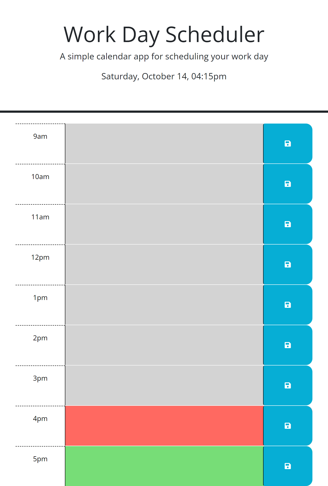

# Work Day Scheduler Web Application

The Work Day Scheduler is a simple web application that allows you to schedule your workday tasks. It provides a visual representation of your day, with the ability to add, edit, and save tasks for each hour.

## Links
Repo: https://github.com/Evan8383/work-day-task-scheduler
Live Page: https://evan8383.github.io/jquery-calendar/

## Features

1. **Time Blocks:** The app displays time blocks for each hour of the workday (from 9 AM to 5 PM).

2. **Task Scheduling:** You can click on the text area within each time block to schedule tasks.

3. **Data Persistence:** Scheduled tasks are saved to the browser's local storage, ensuring that your tasks persist even after refreshing the page.

4. **Visual Indicators:** Time blocks are color-coded:
   - Gray: Past hours.
   - Red: The current hour.
   - Green: Future hours.

5. **Dynamic Date and Time:** The app dynamically displays the current date and time at the top of the page.
## Screenshots

## Usage

1. Clone or download the repository to your local machine.

2. Open the `index.html` file in a web browser.

3. Schedule your tasks by clicking on the text area in the respective time blocks.

4. Click the "Save" button to save your tasks. They will be stored in local storage.

5. Your tasks will persist even after refreshing the page.

## Dependencies

The application uses the following libraries and technologies:

- jQuery: To simplify DOM manipulation and interaction.
- dayjs: A lightweight library for date and time formatting.

## File Structure

- `index.html`: The HTML structure of the web application.
- `style.css`: The CSS file for styling the application.
- `script.js`: The JavaScript code responsible for functionality.
- `README.md`: The documentation you are currently reading.

## License

This code is provided under the MIT License. You are free to use, modify, and distribute it according to the terms of the license.

## Author

* Evan Bennett

Feel free to add your name or contact information to the "Author" section.

Happy scheduling your work day with the Work Day Scheduler!
